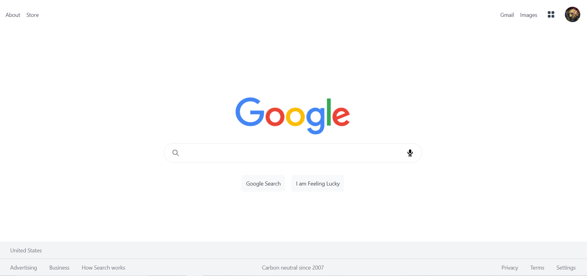
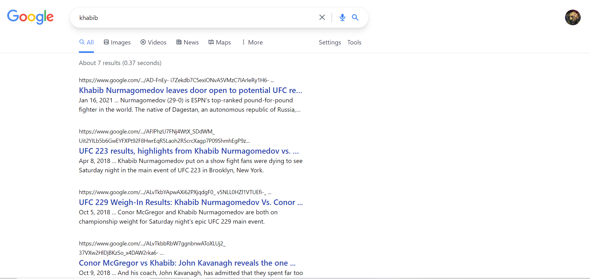
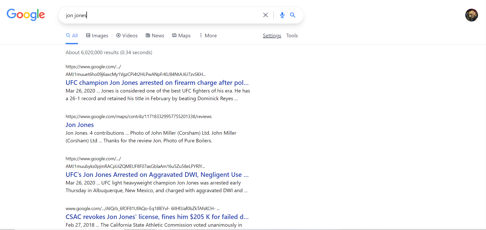
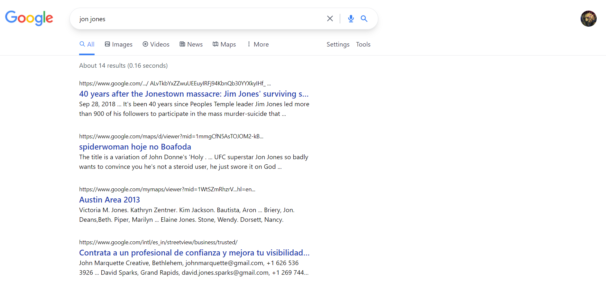

# Google-clone

This is my second attempt at making a Google Search engine clone. The first time, I used the Wikipedia api but I wanted to try and use the Google search api. This project was both difficult and fun and I learned a lot. I used Next.js again, as well as Tailwind.css. They are both two really great and robust frameworks and I'll be using them again in the future. The google search api was kind of a pain to work with though.

## Environment Setup

1. Clone my repo at https://github.com/davidmstanleyjr/google-clone
2. CD into it and type "npm install".
3. Then type "NPM run dev".

## Technologies Used

1. React
2. Hero Icons
3. Tailwind CSS
4. Next.js
5. React DOM
6. Tailwind CSS Lineclamp
7. Google Search API

# Issues

This project wasn't too bad but I ended up working with an API that doesn't work as expected. Google search api restricts how many times per day you can query their API. That was annoying because sometimes I'll get hundreds of search results and other times I'll get significantly less.

I also had to write logic for actually searching for stuff and I had to write more logic for pulling the results an populating them on to the page. That was tough to do. Then I had to write more logic for pagination. That gives my application the ability to go from one page of search results to the next.

Then I had to have a header and footer that appears on each page and I also had to include the ability to search from the search bar regardless of what page you were on. I didn't want people to have to only search from the home page. These were all things that I had to implement that I never thought about having to implement.

## Screenshots

## Live Page

Here is a link to the deployed site
https://davids-search.vercel.app/
